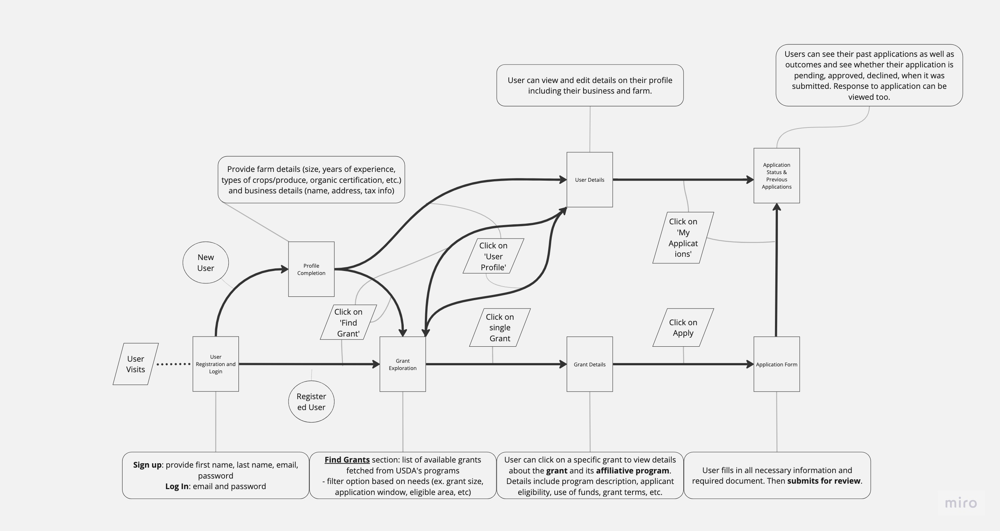
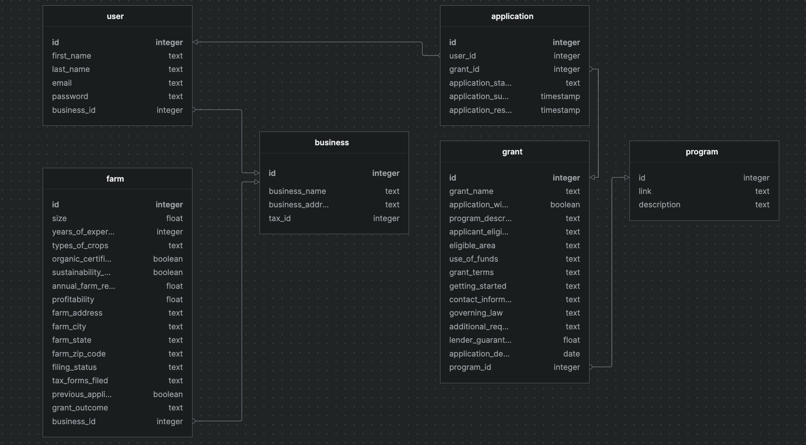

# SeedMoney - Your Grant Application Companion

# SeedMoney App Git Documentation

## Table of Contents
1. [Introduction](#introduction)
2. [Repository Structure](#repository-structure)
3. [User Flow](#user-flow)
4. [Technology Stack](#technology-stack)
5. [Features](#features)
   - [Grant Recommendation Algorithm](#recommendation)
   - [Grant Directory](#feature-grant-directory)
   - [Grant Details](#feature-grant-details)
   - [Grant Application](#feature-grant-application)
   - [My Applications](#feature-my-applications)
   - [User Profile](#feature-user-profile)
   - [Recommendation Algorithm](#recommendation-algorithm)
6. [Frontend](#frontend)
   - [Installation](#frontend-installation)
   - [Development](#frontend-development)
   - [Production Build](#frontend-production-build)
7. [Backend](#backend)
   - [Installation](#backend-installation)
   - [Development](#backend-development)
   - [API Documentation](#backend-api-documentation)
8. [Tests](#tests)   
9. [API Documentation](#api-documentation)

## 1. Introduction 

Welcome to SeedMoney, a comprehensive web application designed to provide information about grants available for farmers and allow them to apply for grants online. The application is built with a React frontend and a Node.js and Express backend. You can access the deployed application [here](<insert-deployed-url-here>)**STILL REQUIRES IMPLEMENTATION**.

## 2. Repository Structure 
The SeedMoney app repository follows a typical structure for a full-stack web application. The main folders and files include:
- `frontend/`: Contains the frontend codebase.
  - `src`:
     - `Application`
     - `Auth`
     - `Dashboard`
     - `Grant`
     - `Program`
     - `components`
     - `store`
     - `ThemeStyles.js`
     - `SeedMoneyApi.js`
- `backend/`: Contains the backend codebase.
  - `models`
  - `routes`
  - `middleware`
  - `helpers`
  - `schemas`
  - `scraper`
- `README.md`: Overview and getting started instructions.

## 3. User Flow

A typical user flow for the website would be as follows:
1. The user registers and logs in.
2. The user browses the Grant Directory to view available grants.
3. The user clicks on a grant to view its details.
4. The user decides to apply for the grant and fills out the application form.
5. The user submits the application.
6. The user can view their submitted applications in the My Applications page.
7. The user can view and edit their profile in the User Profile page.

### User Flow

## 4. Technology Stack

SeedMoney is built using the following technologies:

- Frontend: React, JavaScript
- Backend: Node.js, Express
- Database: PostgreSQL

### Database Schema

## 5. Features <a name="features>
SeedMoney offers a variety of features to assist farmers in their grant application process:

## 5. Features 
These features were chosen to provide a comprehensive and user-friendly experience for farmers seeking grant opportunities.The SeedMoney app includes the following key features:

### 5.1 Grant Directory 
This feature serves as a comprehensive database of available grants. It provides a user-friendly interface where users can browse through a list of grants. Each grant listing provides a brief overview, allowing users to quickly scan and identify potential opportunities.

### 5.2 Grant Details 
For users interested in learning more about a specific grant, the Grant Details feature provides a deep dive into the grant's specifics. It displays detailed information about the grant, including its name, description, eligibility criteria, use of funds, and contact information. This feature is designed to provide users with all the information they need to decide whether to apply for a grant.

### 5.3 Grant Application 
The Grant Application feature simplifies the application process. Users can apply for a grant directly through the platform by filling out a form. The form is designed to collect all necessary information, including farm details, crops grown, animals raised, and a brief description of the application proposal. This feature streamlines the application process, making it easier for users to apply for multiple grants.

### 5.4 My Applications 
This feature provides users with a dashboard to manage their grant applications. It displays a list of all applications submitted by the user, along with key information such as the grant name, application status, and submission date. This feature helps users keep track of their applications and stay updated on their status.

### 5.5 User Profile 
The User Profile feature provides a personalized space for users on the platform. It displays information about the user, including their name and email address. In addition, it provides a detailed view of the user's associated farms and businesses, providing a comprehensive overview of the user's agricultural operations.

### 5.6 Recommendation Algorithm 
One of the standout features of SeedMoney is its recommendation algorithm. This feature uses information about the user's business and farm to provide personalized grant recommendations. By matching the user's needs with the eligibility criteria of various grants, the recommendation algorithm helps users discover grants that they are most likely to qualify for.

## 6. Frontend 
The frontend of the SeedMoney app is developed using React, JavaScript, and various frontend libraries. It provides the user interface for interacting with the application.

### 6.1 Installation 
To set up the frontend development environment, follow these steps:
1. Clone the repository: `git clone <repository-url>`.
2. Navigate to the `frontend/` directory: `cd frontend`.
3. Install the dependencies: `npm install`.

### 6.2 Development 
To run the frontend in development mode, follow these steps:
1. Navigate to the `frontend/` directory: `cd frontend`.
2. Start the development server: `npm start`.
3. Access the application in a web browser at `http://localhost:3000`.

### 6.3 Production Build 
To create a production build of the frontend, follow these steps:
1. Navigate to the `frontend/` directory: `cd frontend`.
2. Build the application: `npm run build`.
3. The production-ready files will be generated in the `frontend/build/` directory.

## 7. Backend 
The backend of the SeedMoney app is built using Node.js, Express, and MongoDB. It provides the API endpoints for data retrieval and manipulation.

### 7.1 Installation 
To set up the backend development environment, follow these steps:
1. Clone the repository: `git clone <repository-url>`.
2. Navigate to the `backend/` directory: `cd backend`.
3. Install the dependencies: `npm install`.

### 7.2 Development 
To run the backend server in development mode, follow these steps:
1. Navigate to the `backend/` directory: `cd backend`.
2. Start the development server: `npm start`.
3. The backend server will be running on `http://localhost:8000`.

## 8. Tests **STILL REQUIREMENTS IMPLEMENTATION**

Tests for the application are located in the `__tests__` directory within each component directory in the frontend. To run the tests, navigate to the frontend directory and run `npm test`.

### 9. API Documentation 
The backend API of SeedMoney follows RESTful principles and provides several endpoints for data retrieval and manipulation. The API is documented in the `backend-api-documentation` section of the original README file. The application also includes a web scraper class in the backend directory `scraper` for programs and grants. The backend API of the SeedMoney app follows RESTful principles and provides the following endpoints:

#### User Endpoints
 - POST /auth/register: Registers a new user.
 - POST /auth/token: Logs in a user and returns a token.
 - GET /users/:id: Retrieves user details.
 - PATCH /users/:id: Updates user details.

#### Business Endpoints
 - GET /users/:id/businesses: Retrieves a list of businesses associated with a user.
 - POST /businesses/register: Registers a new business for a user.
 - PATCH /businesses/:id: Updates a business.

#### Farm Endpoints
 - GET /users/:id/farms: Retrieves a list of farms associated with a user.
 - POST /farms/register: Registers a new farm for a user.
 - PATCH /farms/:id: Updates a farm.

#### Grant Endpoints
 - GET /grants: Retrieves a list of grants.
 - GET /grants/:id: Retrieves detailed information about a specific grant.

#### Application Endpoints
 - GET /users/:id/applications: Retrieves a list of applications submitted by a user.
 - POST /applications: Creates a new application.
 - GET /applications/:id: Retrieves detailed information about a specific application.
 - PATCH /applications/:id: Updates an application.
 - DELETE /applications/:id: Deletes an application.

